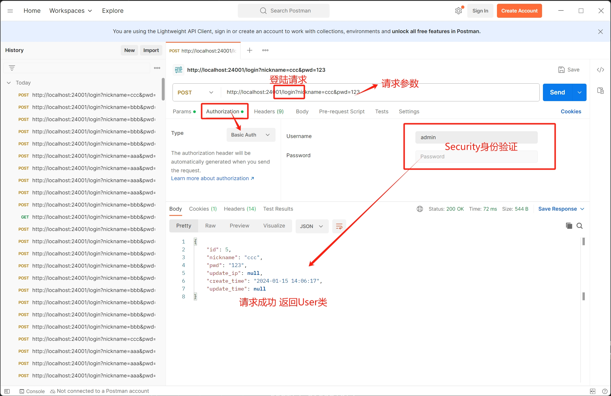

# 登陆功能
+ 仅举例简单的登陆注册

## 实体类

```entity
@Data
@Entity
@Table(name = "User")
public class User {
    @Id
    @GeneratedValue(strategy = GenerationType.IDENTITY)
    private int id;
    private String nickname;
    private String pwd;
    private String update_ip;

    @JsonFormat(pattern = "yyyy-MM-dd HH:mm:ss")
    private LocalDateTime create_time;
    private LocalDateTime update_time;
}


```

## JPA仓库
```repository
public interface UserRepository extends JpaRepository<User, Integer> {

    User findByNickname(String nickname);
}

```

## 服务类
```service
public interface UserService {
    User RegisterUser(String nickname, String pwd);

    boolean login(String nickname, String password);

    User getUserByNickname(String nickname);
}

```

## 实现类

```ServiceImpl
@Service
public class CommentImpl implements CommentService {
    private final CommentRepository commentRepository;

    @Autowired
    public CommentImpl(CommentRepository commentRepository) {
        this.commentRepository =commentRepository;
    }

    @Override
    public Comment saveComment(String content) {
        Comment comment =new Comment();
        comment.setContent(content);
        comment.setTime(LocalDateTime.now());
        return commentRepository.save(comment);
    }
}


```
## 控制类

```controller
@RestController
public class UserController {
    private final UserService userService;

    @Autowired
    public UserController(UserService userService) {
        this.userService = userService;
    }

    @PostMapping("/register")
    public ResponseEntity<User> RegisterUser(@RequestBody UserRequest userRequest) {
        User user = userService.RegisterUser(userRequest.getNickname(), userRequest.getPwd());
        return new ResponseEntity<>(user, HttpStatus.CREATED);
    }

    @PostMapping("/login")
    public ResponseEntity<?> login(@RequestParam String nickname, @RequestParam String pwd) {
        boolean loginResult = userService.login(nickname, pwd);
        if(loginResult) {
            User user = userService.getUserByNickname(nickname);
            return ResponseEntity.ok(user);
        }
        return ResponseEntity.status(HttpStatus.UNAUTHORIZED).body("sorry, u pwd is wrong!");
    }

    public static class UserRequest {
        private String nickname;
        private String pwd;

        public String getNickname() {
            return nickname;
        }

        public void setNickname(String nickname) {
            this.nickname = nickname;
        }

        public String getPwd() {
            return pwd;
        }

        public void setPwd(String pwd) {
            this.pwd = pwd;
        }

    }
}


```


